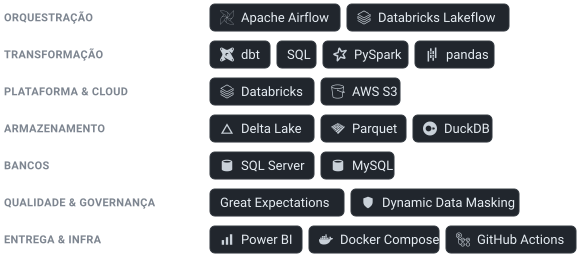

## Lucas Santos

Engenheiro de dados. Passo a maior parte do tempo ligando dois mundos: os
sistemas que a empresa já roda no dia a dia e a plataforma analítica que ela
ainda quer ter. Na prática, isso é ingestão, orquestração, modelagem em camadas
e governança — do banco de origem até o mart que alguém abre numa ferramenta
de BI.

O que eu levo a sério é o porquê de cada escolha. Uma decisão de arquitetura só
vale se aguenta a segunda pergunta, e saber quando *não* usar uma ferramenta
costuma pesar mais do que conhecer todas.



---

### Em destaque — [legacy-to-lakehouse](https://github.com/lsantos-data/legacy-to-lakehouse)

Uma migração de ponta a ponta: o AdventureWorks, um backoffice em SQL Server,
sendo modernizado e integrado com dados de e-commerce (Olist) e câmbio (Banco
Central). Roda inteiro na máquina local — sem nuvem, sem cartão, sem serviço
pago. Um `docker compose up` e o pipeline todo sobe.

```text
fontes             ingestão           Bronze             Silver        Gold
───────────────    ───────────────    ───────────────    ──────────    ────
SQL Server         Airflow            MinIO / Parquet    dbt-duckdb    marts por
MySQL · API BCB    watermark, 4 DAGs  particionado       18 staging    domínio
```

Alguns pontos que valem destaque:

- **É de ponta a ponta, não um trecho** — da extração incremental no Airflow até
  os marts, com o dbt lendo o Parquet direto do MinIO via `httpfs`: não existe
  etapa de carga no meio, e ainda assim o comportamento é o de um warehouse
  colunar.
- **O SQL legado não é enfeite** — uma view que dependia de XQuery e XML nativos
  do SQL Server foi portada para `regexp_extract` no dbt e bate 1:1 com a
  original, nas 19.972 linhas. Um `PIVOT` antigo virou formato long/tidy em vez
  de reproduzir o anti-padrão.
- **A governança foi testada no motor** — Dynamic Data Masking de verdade no SQL
  Server: um login sem permissão vê `K*** S***` onde o `sa` vê `Ken Sánchez`. E
  a máscara é reaplicada na camada Gold, porque ela não viaja junto com a
  extração.
- **O benchmark é honesto** — Pandas contra PySpark no mesmo dado. O Pandas
  ganhou por ~3,3× em ~6 milhões de linhas, e o repositório explica por que esse
  era o resultado esperado nesse volume.
- **O tuning tem número de antes e depois** — reescrever um predicado
  não-sargável para range com índice de apoio derrubou as leituras lógicas de
  686 para 49.

---

### Como eu penso sobre engenharia de dados

Toda decisão de arquitetura tem um porquê que foi testado contra o ambiente real
e escrito em algum lugar — inclusive as que falharam antes de dar certo.

A camada Bronze fica crua. Transformação e mascaramento são responsabilidade de
cada ponto de acesso ao dado, não do dado que está guardado.

E o pipeline não está pronto até um clone limpo rodar. É por isso que o CI roda
`dbt parse`, lint de SQL e Python, varredura de segredo e auditoria de
dependência a cada push.

---

### Contato

Aberto a conversas sobre posições de Engenheiro de Dados (Pleno/Sênior).

- LinkedIn — [linkedin.com/in/lucas-santos-696061186](https://www.linkedin.com/in/lucas-santos-696061186/)
- Email — [lucasss.sillva@hotmail.com](mailto:lucasss.sillva@hotmail.com)
