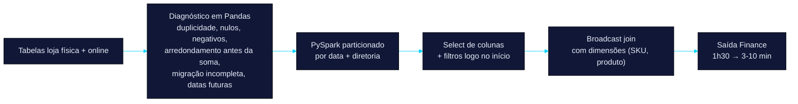
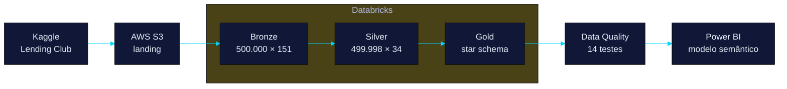

<picture>
  <source media="(prefers-color-scheme: dark)" srcset="assets/header-dark.svg">
  <source media="(prefers-color-scheme: light)" srcset="assets/header-light.svg">
  
</picture>

## Resultados de Impacto

| Métrica | Antes | Depois | Contexto |
|---|---|---|---|
| **Account Takeover (ATO) Detection** | 200 casos/dia (análise manual) | 0 — 100% automação | Experiência profissional (Shopee) |
| **Finance Pipeline Execution** | 1h30min | 3–10 min | Experiência profissional (Databricks, Casas Bahia) |
| **Power BI Dashboard Size** | 2 GB | 350 MB | Otimização de modelo Delta Lake existente |

> Números de experiência profissional — dado proprietário do empregador, sem repositório público. Para código real, ver [Projetos](#projetos) abaixo.

**[Execute meu pipeline →](https://lsantos-data.github.io/lsantos-data/)**
Landing page interativa: você roda o pipeline, filtra o stack por query e investiga o bug do Recovery Rate ao vivo.

---

<strong>Bugs que eu encontrei</strong>

### Recovery Rate de 288,6% — proxy de prejuízo errado

No pipeline [data-engineering-credit-risk](https://github.com/lsantos-data/data-engineering-credit-risk), ao validar as medidas DAX contra o modelo ao vivo, a métrica **Recovery Rate** deu **288,6%** — matematicamente impossível, já que não é possível recuperar mais do que se perdeu.

> Métrica acima de 100% não é resultado, é sintoma.

**Causa:** `Total Charge-Off` usava `out_prncp` (saldo em aberto *atual*) como proxy de prejuízo. Esse campo zera para contratos já baixados como prejuízo, inflando a taxa de recuperação sobre uma base artificialmente pequena.

**Correção:** troquei a base de prejuízo para `funded_amnt − total_rec_prncp` (principal não recuperado via pagamento normal).

| Métrica | Antes (errado) | Depois (corrigido) |
|---|---|---|
| Total Charge-Off | R$ 35,0 Mi | R$ 901,4 Mi |
| Recovery Rate % | 288,6% | 11,2% |
| Portfolio Loss Rate % (líquida) | 0,45% | 10,4% |

Detalhe completo em [docs/dax_measures.md](https://github.com/lsantos-data/data-engineering-credit-risk/blob/main/docs/dax_measures.md#achados-de-qualidade-de-dados). Deixo o erro documentado de propósito: a validação pegar (e corrigir) o próprio erro antes de alguém de fora pegar é parte do processo, não uma falha a esconder.

<strong>Anatomia de uma decisão — Finance, 1h30 → 3-10 min</strong>

Pipeline de Finance (Databricks, Casas Bahia): tabelas de loja física e online, diagnosticadas em Pandas, depois processadas em PySpark com particionamento pensado para a forma como os dados são consultados.

- **O diagnóstico veio antes da otimização** — sem entender por que os números batiam errado (duplicidade, arredondamento antes da soma, migração incompleta), particionar não teria resolvido nada.
- **Particionar por `data` + `diretoria`** porque é assim que a área consome o dado — toda consulta corta por esses dois eixos.
- **Select e filtro no início do plano**, não no fim — reduz o volume que atravessa o resto do pipeline em vez de descartar depois de processar tudo.
- **Broadcast join** nas dimensões pequenas (SKU, produto) evita shuffle desnecessário contra a tabela fato.

<strong>Tech Radar</strong>

<picture>
  <source media="(prefers-color-scheme: dark)" srcset="assets/radar-dark.svg">
  <source media="(prefers-color-scheme: light)" srcset="assets/radar-light.svg">
  
</picture>

**Domínio (produção):** SQL · PySpark/Spark · Databricks · Python/pandas
**Uso com confiança:** AWS S3 · Snowflake · Presto · Delta Lake · Airflow · Power BI
**Estudando agora:** dbt · DuckDB · MinIO · Docker

O radar visual mostra 12 dos 14 itens acima (limite de legibilidade do gráfico) — Snowflake e Presto ficam de fora dos pontos, mas continuam na lista.

<strong>Estudos recentes</strong>

| Tema | Por que estudo | Evidência |
|---|---|---|
| Fundamentals of Data Engineering (Joe Reis & Matt Housman) | Consolidar fundamentos de arquitetura e pipelines | Livro — em andamento |
| Fundamentos da Qualidade de Dados | Aprofundar em validação e confiabilidade de dados | Livro — em andamento |
| Data with Baraa (YouTube) | Aprendizado contínuo em data engineering | [Canal](https://www.youtube.com/@DataWithBaraa) |
| Projeto educacional Python/pandas → PySpark | Aprender ensinando, reforçar fundamentos | Projeto — em construção |

Revisado em set/2026.

<strong>Projetos</strong>

### [legacy-to-lakehouse](https://github.com/lsantos-data/legacy-to-lakehouse) — migração local, custo zero

Um backoffice em SQL Server (AdventureWorks) modernizado e integrado com dados de e-commerce (Olist) e câmbio (Banco Central). Roda inteiro na máquina — `docker compose up` e o pipeline todo sobe.

- **19.972 linhas** migradas e validadas 1:1 contra o SQL Server original
- **3,3× mais rápido** — benchmark honesto de Pandas vs. PySpark em ~6 milhões de linhas
- **686 → 49 leituras lógicas** depois de reescrever um predicado não-sargável para range com índice de apoio
- Dynamic Data Masking de verdade no motor, reaplicada na camada Gold
- Docker Compose + Airflow + dbt + DuckDB + MinIO

### [data-engineering-credit-risk](https://github.com/lsantos-data/data-engineering-credit-risk) — o mesmo rigor, na nuvem

Pipeline de risco de crédito sobre o dataset do Lending Club (500 mil empréstimos, 151 colunas), em Databricks + AWS S3 + Delta Lake, orquestrado por Lakeflow Jobs.

- **500 mil empréstimos**, 151 colunas → star schema (`gold_fact_loan` + 3 dimensões) com integridade referencial validada por teste automatizado
- **14 testes de qualidade** bloqueiam o pipeline — 8 na Silver (range, domínio, not-null), 6 na Gold (integridade referencial, unicidade de chave) — zero retry em teste de qualidade, porque retry mascara problema real
- Databricks Secrets para credenciais, dashboard Power BI com as medidas DAX versionadas no repo

Também no GitHub: <a href="https://github.com/lsantos-data/fraud-detection">fraud-detection</a> — projeto de estudo com dataset público (Kaggle), 90,7% precisão / 75,4% recall em classificação de fraude · <a href="https://github.com/lsantos-data/medallion-commerce-pipeline">medallion-commerce-pipeline</a> — contratos de qualidade e zona de quarentena em Python puro.

### Fraud Prevention — Automação de Account Takeover

*Experiência profissional (Shopee) — dado proprietário do empregador, sem repositório público. Não confundir com o repo `fraud-detection` acima, que é um projeto de estudo com dataset aberto.*

Construído em SQL + PySpark dentro de uma arquitetura Lakehouse, com duas trilhas de detecção:

- **Preventiva** — monitora sinais de mudança de comportamento na conta
- **Reativa** — reconcilia o formulário de contestação com o histórico da conta, casando por vínculos fortes e fracos

Resultado: substituição de triagem manual (200 casos/dia) por classificação automatizada, decisão baseada em ML em vez de regras estáticas. Detalhe operacional (janelas, ordem de checagem, sinais específicos) fica para conversa em entrevista.

<strong>Como eu penso sobre engenharia de dados</strong>

1. **Decisão > perfeição** — arquitetura é trade-off; saber quando *não* usar uma ferramenta pesa mais do que conhecer todas.
2. **Código é comunicação** — se alguém com menos contexto não entende a lógica em 5 minutos, o problema é meu, não dele.
3. **Teste antes de comemorar** — uma otimização de 30% que quebra em produção com carga real vale 0%.
4. **Escala é real** — "funciona local" não é suficiente; centenas de milhares de registros e clusters gerenciados são outro jogo.
5. **Documentação é dívida técnica** — código sem o "porquê" hoje é "por que ninguém sabe" depois.

---

## Contato

Aberto a conversas sobre:
- **Engenheiro de Dados** (Sênior/Staff) — arquitetura, mentoria, POC
- **Fraud Prevention & Risk Analytics** — detecção, automação, ML em produção
- **Lakehouse & Data Governance** — design, qualidade, migração legacy

- LinkedIn — [linkedin.com/in/lucas-santos-696061186](https://www.linkedin.com/in/lucas-santos-696061186/)
- Email — [lucasss.sillva@hotmail.com](mailto:lucasss.sillva@hotmail.com)
- Portfólio animado — [lsantos-data.github.io/lsantos-data](https://lsantos-data.github.io/lsantos-data/)
